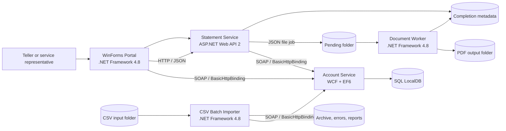

# Architecture

## Legacy component topology

## Local endpoints and storage

| Resource | Default |
|---|---|
| Account WCF service | `http://localhost:8090/AccountService` |
| Statement HTTP API | `http://localhost:8091/api/statements` |
| Database | `(localdb)\MSSQLLocalDB`, database `ContosoLegacyBank` |
| Document root | `%LOCALAPPDATA%\ContosoLegacyBank\Documents` |
| Batch root | `%LOCALAPPDATA%\ContosoLegacyBank\Batch` |

All values are configuration driven. The defaults make a workshop clone work without external infrastructure.

## Key scenarios

### Browse accounts

1. The portal sends a synchronous SOAP request to the account service.
2. The WCF service applies business rules and reads EF6 entities from LocalDB.
3. Data-contract DTOs are returned to the portal's generated-style proxy.

### Generate a statement

1. The portal posts a statement request to Web API 2.
2. The statement service validates ownership and retrieves transactions through WCF.
3. It writes a complete, versioned JSON job to the pending folder using an atomic file move.
4. The document worker claims the job, writes a PDF, and emits completion or failure metadata.
5. The portal polls the statement API and opens the completed PDF.

### Import transactions

1. The batch app claims a CSV from the input folder.
2. Each row is parsed and validated.
3. Valid rows are submitted to the account WCF service.
4. Duplicate external IDs are reported separately from invalid rows.
5. The source file is archived or moved to the error folder and a reconciliation report is written.

## Intentional modernization seams

| Legacy seam | Why it exists | Expected target |
|---|---|---|
| WinForms UI | Demonstrates desktop-to-web UI replacement | Blazor |
| WCF SOAP service | Demonstrates contract and client migration | ASP.NET Core REST |
| EF6 and LocalDB | Demonstrates data/runtime modernization | EF Core and Azure SQL |
| Web API 2 | Demonstrates ASP.NET Framework server migration | ASP.NET Core |
| File-system queue | Demonstrates coupling and local durability limitations | Service Bus or Storage Queues |
| Local PDF output | Demonstrates machine-bound storage | Blob Storage |
| Scheduled CSV console | Demonstrates batch hosting and replay concerns | Functions or Container Apps Jobs |
| Config-file endpoints | Demonstrates environment-specific configuration | Typed options and managed configuration |
| Synchronous calls | Makes latency and resilience visible | Async I/O, timeouts, retries, cancellation |

The baseline must remain behaviorally correct. Legacy seams are not permission to add secrets, unsafe deserialization, injection flaws, or silent error handling.
