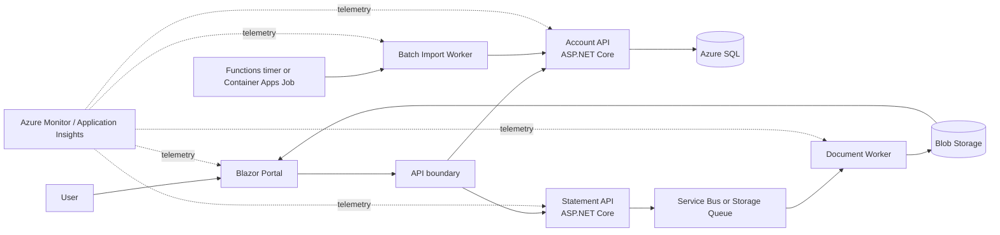

# Azure Target Architecture

This is a modernization destination, not part of the local legacy baseline.

## Service mapping

| Legacy capability | Candidate Azure target | Decision factors |
|---|---|---|
| WinForms portal | Azure App Service-hosted Blazor; Static Web Apps if a separate API and client model fit | Server interaction model, networking, authentication, scaling |
| Account and statement APIs | Azure App Service or Azure Container Apps | Operational model, container requirements, private networking, scale |
| LocalDB | Azure SQL Database | compatibility, sizing, zone redundancy, private endpoint, migration downtime |
| Document file queue | Azure Service Bus or Storage Queues | ordering, sessions, dead-lettering, transactions, cost |
| PDF output folder | Azure Blob Storage | lifecycle, immutability, encryption, private access, retention |
| Scheduled CSV importer | Azure Functions timer trigger or Container Apps Jobs | duration, dependencies, execution control, scale |
| App configuration | App configuration plus environment settings | feature flags, refresh, ownership |
| Secrets | Managed identity and Key Vault when secrets remain necessary | supported identity flow, rotation, network access |
| Logs and metrics | Application Insights and Azure Monitor | sampling, retention, alerting, correlation |

## Required architecture decisions

- Select a currently supported .NET release based on Microsoft support policy at implementation time.
- Decide whether APIs need private ingress and whether the portal is public or network restricted.
- Define Microsoft Entra ID users, app identities, roles, and authorization boundaries.
- Choose Service Bus when dead-lettering, sessions, richer delivery controls, or transactions are required; otherwise evaluate Storage Queues for simplicity and cost.
- Define SQL availability, backup retention, recovery objectives, migration method, and rollback.
- Define PDF retention, legal/compliance requirements, and secure download behavior.
- Define regional strategy, availability zones, health probes, deployment slots/revisions, and rollback.
- Establish budgets and validate current regional pricing before deployment.

## Migration safeguards

- Preserve WCF and REST coexistence until all consumers migrate.
- Dual-run or reconcile critical transaction paths before cutover.
- Use idempotency keys for transaction imports and document jobs.
- Keep database schema changes backward compatible during coexistence.
- Validate generated statements against baseline totals and representative PDFs.
- Do not expose LocalDB files, CSV inputs, or generated PDFs publicly during migration.

Useful starting points:

- [Azure application modernization guidance](https://learn.microsoft.com/azure/app-modernization-guidance/get-started/)
- [Choose App Service, Container Apps, or AKS](https://learn.microsoft.com/azure/app-modernization-guidance/foundation/)
- [Modernize ASP.NET applications](https://learn.microsoft.com/azure/app-modernization-guidance/optimize/modernize-asp-net-and-asp-net-core-web-applications)
- [Azure SQL migration guidance](https://learn.microsoft.com/en-us/azure/azure-sql/migration-guides/)
- [Azure Well-Architected Framework](https://learn.microsoft.com/en-us/azure/well-architected/)
