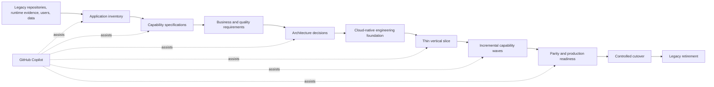
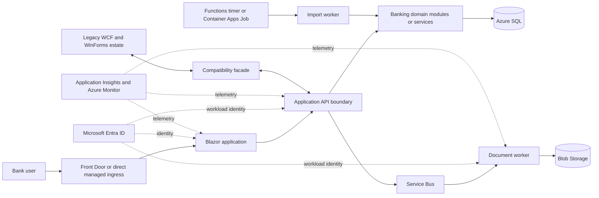

# Greenfield cloud-native replacement playbook

## Purpose

This playbook describes how to analyze a legacy application spread across
multiple repositories and build a new cloud-native application that replaces
its business capabilities.

The goal is not to translate old code line by line. The goal is to:

- recover trustworthy business behavior from code, configuration, tests,
  databases, files, integrations, and users;
- decide which behavior must be preserved, improved, or retired;
- design a cloud-native target that satisfies measurable business and
  operational requirements;
- use GitHub Copilot to accelerate discovery, specification, planning,
  implementation, testing, and documentation;
- migrate in controlled capability slices while the legacy application remains
  available;
- prove parity and operational readiness before retiring legacy components.

This approach is **greenfield implementation with brownfield behavior**.

## Core principles

### 1. Replace capabilities, not repositories

A repository is a source-control boundary. It is not automatically a business
or service boundary.

One business capability can span:

- desktop UI code;
- WCF or HTTP services;
- database tables and stored procedures;
- scheduled jobs;
- file exchanges;
- document generation;
- external integrations.

Discover the complete behavior before choosing the new application boundary.

### 2. Treat code as evidence, not business intent

Legacy code shows what the system currently does, including defects,
workarounds, obsolete behavior, and accidental coupling. It does not prove what
the business wants the replacement to do.

Separate:

- **Observed behavior**: supported by code, tests, data, logs, or runtime
  evidence.
- **Business requirement**: confirmed by a product owner or domain expert.
- **Assumption**: plausible but not yet approved.
- **Unknown**: evidence is incomplete or contradictory.
- **Intentional change**: approved difference from the legacy system.

### 3. Do not begin with a big-bang rewrite

Use an incremental replacement strategy, commonly the
[Strangler Fig pattern](https://learn.microsoft.com/en-us/azure/architecture/patterns/strangler-fig).

Introduce a façade or compatibility boundary that can route each migrated
capability to either the legacy or new implementation. Move functionality in
small slices, validate it, and retain a rollback path.

### 4. Build the smallest architecture that meets the requirements

Cloud native does not mean "use every managed service" or "create a
microservice for every table."

Start with:

- clear domain modules;
- managed platform services;
- stateless compute where practical;
- externalized state;
- secure identity;
- automated delivery;
- observability;
- resilience appropriate to the business impact.

A modular monolith can be a better greenfield starting point than many
microservices when the team, scale, and domain boundaries do not justify
distributed complexity.

### 5. Make modernization decisions reviewable

Every important decision should include:

- context and requirements;
- selected option;
- alternatives considered;
- trade-offs;
- security, reliability, cost, and operational implications;
- migration and rollback impact;
- evidence and approval.

Use architecture decision records rather than leaving decisions only in chat
history.

### 6. Keep repository ownership explicit

Cross-repository analysis is application wide. Implementation remains
repository owned.

Every work package needs:

- one owning repository;
- upstream and downstream dependencies;
- contract version;
- acceptance criteria;
- deployment order;
- coexistence behavior;
- rollback procedure.

## Target delivery model



GitHub Copilot accelerates the work. It does not own architecture approval,
business decisions, production authorization, or legacy retirement.

## Phase 0: Establish scope, governance, and evidence rules

### Questions to answer

- What business outcomes justify replacement?
- Which users and business processes depend on the application?
- Which capabilities are mandatory, optional, obsolete, or legally required?
- What is the deadline, budget, and acceptable coexistence period?
- Which teams own the current and future systems?
- What regulations, data classifications, and residency requirements apply?
- What are the availability, recovery, performance, and support expectations?

### Define decision authorities

Identify owners for:

- product and capability behavior;
- architecture;
- security and compliance;
- data;
- platform and networking;
- operations and support;
- migration and cutover;
- financial approval.

### Establish evidence conventions

Every assessment claim should cite:

- repository and revision;
- file and symbol;
- configuration setting;
- database object;
- runtime trace or log;
- test;
- user or domain-owner confirmation.

### Outputs

- application charter;
- repository and owner inventory;
- decision log;
- evidence standard;
- modernization success measures;
- initial risk register.

## Phase 1: Build a multi-repository current-state inventory

Use the workflows in
[Multi-repository modernization scenarios](multi-repository-modernization.md).
The inventory should include all repositories and non-code dependencies.

### Repository inventory

For each repository, record:

- purpose and owner;
- languages, frameworks, and target runtimes;
- build, test, and release process;
- executable entry points;
- deployment model;
- inbound and outbound contracts;
- configuration and secrets;
- data stores;
- file shares and scheduled jobs;
- external systems;
- supported environments;
- operational dashboards and alerts;
- known risks and unsupported dependencies.

### Runtime topology

Code structure alone is insufficient. Record:

- which processes run;
- startup order;
- endpoint addresses and protocols;
- authentication and authorization;
- network boundaries;
- synchronous and asynchronous dependencies;
- data ownership;
- scheduled execution;
- manual operational steps;
- failure and recovery behavior.

### Contract inventory

Create a producer/consumer matrix:

| Contract | Producer | Consumers | Data | Failure semantics | Versioning |
|---|---|---|---|---|---|
| WCF operation | | | | | |
| HTTP endpoint | | | | | |
| Queue or event | | | | | |
| JSON/XML file | | | | | |
| CSV import/export | | | | | |
| Database schema | | | | | |
| Generated document | | | | | |

### Runtime validation

For each critical workflow:

1. run it against known synthetic data;
2. capture inputs and outputs;
3. record database changes;
4. capture calls across repository boundaries;
5. exercise failure paths;
6. save screenshots, documents, reports, and logs;
7. add characterization tests where behavior is not protected.

### Copilot assessment prompt

> Analyze all attached repositories as one application. Remain read-only.
> Inventory runtime processes, entry points, contracts, consumers, data stores,
> background jobs, configuration, external dependencies, and operational
> assumptions. Trace each critical business workflow across repositories.
> Cite file and symbol evidence. Separate observed facts, inferred behavior,
> assumptions, unknowns, and recommendations.

### Exit criteria

- Every production process has an identified repository and owner.
- Every integration has a producer and consumer.
- Every critical workflow has evidence.
- Unknown behavior has a named decision owner.
- The baseline builds and representative workflows run.

## Phase 2: Convert implementation evidence into capability specifications

Do not organize the replacement backlog around old projects. Organize it around
business capabilities.

Use [`capability-specification.md`](templates/capability-specification.md) for
each bounded capability.

### Capability specification contents

- actor and trigger;
- business outcome;
- business rules;
- authorization;
- inputs and outputs;
- state transitions;
- calculations and monetary precision;
- error and recovery behavior;
- audit requirements;
- integrations;
- data ownership and retention;
- performance expectations;
- observed legacy behavior;
- intentional changes;
- acceptance and characterization tests.

### Capability decomposition guidance

A capability should be:

- understandable by a domain owner;
- independently testable;
- small enough for a controlled migration wave;
- large enough to deliver meaningful behavior;
- explicit about dependencies.

Avoid:

- "rewrite the accounts repository";
- "move all WCF to REST";
- "create all microservices";
- "migrate the database."

Prefer:

- "find a customer and view owned accounts";
- "view account transactions for an authorized date range";
- "request, generate, and retrieve a monthly statement";
- "import transactions idempotently and reconcile rejected rows."

### Use Spec Kit for approved bounded changes

After a capability is understood and approved, use GitHub Spec Kit to define
the future behavior and compatibility boundaries:

1. establish the constitution;
2. specify the bounded capability;
3. clarify unresolved behavior;
4. create the technical plan;
5. generate implementation tasks;
6. analyze artifact consistency;
7. implement;
8. converge specifications and implementation.

Do not ask Spec Kit or Copilot to infer business intent solely from legacy
code.

## Phase 3: Define future-state quality attributes

Architecture selection starts with requirements, not a list of Azure services.

### Reliability

- availability target;
- recovery time objective (RTO);
- recovery point objective (RPO);
- zone and region failure expectations;
- dependency timeout and retry behavior;
- backup and restore;
- degraded-mode behavior;
- disaster-recovery testing.

### Security

- user and workload identities;
- roles and authorization boundaries;
- data classification;
- encryption and key ownership;
- secretless connections;
- public versus private endpoints;
- network segmentation;
- audit and fraud requirements;
- threat modeling;
- software supply-chain controls.

### Performance and scale

- normal and peak request rates;
- batch sizes and completion windows;
- latency targets;
- concurrency;
- document generation volume;
- data growth;
- geographic distribution;
- scale-to-zero tolerance;
- cold-start tolerance.

### Operations

- support ownership;
- deployment frequency;
- release approval;
- observability;
- incident response;
- environment strategy;
- infrastructure ownership;
- maintenance windows;
- service quotas and regional capacity.

### Cost

- expected monthly budget;
- workload utilization pattern;
- development and test environment lifetime;
- fixed versus consumption pricing;
- networking and data-transfer costs;
- monitoring retention;
- backup and disaster-recovery cost;
- temporary coexistence cost.

### Compliance and data

- residency and sovereignty;
- retention and deletion;
- auditability;
- financial record integrity;
- personally identifiable information;
- document retention;
- data migration verification.

Use the
[Azure Well-Architected Framework](https://learn.microsoft.com/en-us/azure/well-architected/)
to review reliability, security, cost optimization, operational excellence,
and performance efficiency.

## Phase 4: Design service and domain boundaries

### Start with the domain

Identify:

- bounded contexts;
- aggregates and transaction boundaries;
- data ownership;
- commands, queries, and events;
- consistency requirements;
- team ownership.

Do not split services only because the legacy system has separate repositories.

### Choose an initial application shape

| Shape | Choose when | Watch for |
|---|---|---|
| Modular monolith | One team, moderate scale, shared release cadence, boundaries still evolving | Enforce module boundaries and avoid a new tightly coupled monolith |
| Few domain services | Clear ownership, independent scaling or release needs, stable contracts | Distributed transactions, versioning, observability, operational overhead |
| Microservices | Strong domain boundaries, multiple autonomous teams, independent scaling and deployment are essential | Network failure, data duplication, testing complexity, platform cost |

For many replacements, begin with a modular monolith plus independent workers.
Extract services later when measured requirements justify the additional
complexity.

### Define the coexistence boundary

Candidates include:

- Azure API Management or another façade for API routing;
- compatibility REST adapters beside WCF;
- an anti-corruption layer translating legacy and new models;
- events emitted from the new application;
- controlled data replication;
- feature flags or routing rules.

The coexistence architecture is temporary but production critical. Design,
monitor, secure, and test it accordingly.

## Phase 5: Select Azure services

Use official Azure decision guides and validate the choice against the quality
attributes. A complete workload can use more than one compute service.

### Compute

| Workload | Primary candidate | Consider alternatives when |
|---|---|---|
| Blazor or standard web application | Azure App Service | Use Static Web Apps for a separately hosted SPA; Container Apps for container-first or multi-service requirements |
| REST API | App Service or Azure Container Apps | Functions for event-driven/function-sized APIs; AKS only when Kubernetes control is required |
| Continuously running worker | Azure Container Apps | Functions for trigger-oriented processing; AKS for advanced orchestration |
| Scheduled batch | Azure Functions timer or Container Apps Jobs | Azure Batch for large parallel compute |
| Event consumer | Azure Functions or Container Apps | Choose based on execution duration, runtime control, scaling, and operations |

Decision factors:

- container requirement;
- scale-to-zero;
- cold-start tolerance;
- runtime duration;
- ingress and networking;
- sidecars;
- deployment model;
- Kubernetes API requirement;
- team operational skills;
- pricing profile.

Use the
[Azure compute decision guide](https://learn.microsoft.com/en-us/azure/architecture/guide/technology-choices/compute-decision-tree)
as a starting point, then validate service-specific constraints.

### Data

| Need | Candidate | Questions |
|---|---|---|
| Relational transactions, joins, SQL compatibility | Azure SQL Database | Required compatibility, sizing, availability, migration downtime, Entra authentication |
| Globally distributed document data | Azure Cosmos DB | Access patterns, partition key, consistency, throughput, cost |
| Files and generated PDFs | Azure Blob Storage | Retention, immutability, private access, lifecycle, legal hold |
| Shared file-system semantics | Azure Files | Is SMB/NFS compatibility actually required, or can the design use objects? |
| Cache | Azure Managed Redis or current recommended Azure cache service | Data loss tolerance, persistence, eviction, private networking |
| Search | Azure AI Search | Full-text, semantic, vector, indexing, data source, cost |

Do not choose a database before defining:

- ownership;
- consistency;
- transaction boundaries;
- query patterns;
- volume and growth;
- retention;
- migration and rollback.

### Messaging and integration

| Message intent | Candidate | Typical use |
|---|---|---|
| Durable command to one consumer | Azure Service Bus queue | Generate statement, process payment, import transaction |
| Publish/subscribe business event | Service Bus topic | Notify multiple business consumers with durable delivery |
| Discrete event routing | Azure Event Grid | Blob created, resource change, lightweight event notification |
| High-volume event stream | Azure Event Hubs | Telemetry, logs, streaming ingestion |
| Simple storage-centric queue | Azure Queue Storage | Basic asynchronous work with fewer broker features |
| Integration workflow | Azure Logic Apps | Connectors, B2B, visual workflow, human approvals |

Questions:

- command or event;
- one consumer or many;
- ordering;
- duplicate handling;
- transactions;
- sessions;
- dead-lettering;
- delivery guarantees;
- replay;
- message size;
- throughput;
- retention.

See
[Azure asynchronous messaging options](https://learn.microsoft.com/en-us/azure/architecture/guide/technology-choices/messaging).

### API boundary

Consider Azure API Management when the application needs:

- one stable client-facing endpoint during strangler migration;
- legacy and modern backends behind the same façade;
- authentication and authorization policy;
- throttling and quotas;
- versioning;
- request/response transformation;
- developer onboarding;
- API analytics.

Do not use a gateway to hide unclear service ownership or create unbounded
distributed coupling.

### Identity and secrets

Candidates:

- Microsoft Entra ID for users and applications;
- managed identities for Azure workloads;
- Azure Key Vault for secrets, keys, and certificates that remain necessary;
- Azure App Configuration for non-secret application configuration and feature
  flags.

Prefer workload identity and role-based authorization over copied connection
strings and shared secrets.

### Observability

Candidates:

- Application Insights for application performance monitoring and distributed
  tracing;
- Azure Monitor and Log Analytics for logs, metrics, alerts, workbooks, and
  operational correlation.

Define before implementation:

- correlation identifiers;
- business and technical telemetry;
- service-level indicators;
- alert thresholds;
- audit events;
- retention;
- sensitive-data filtering;
- cost controls.

### Networking and edge

Evaluate:

- public or private ingress;
- private endpoints;
- virtual network integration;
- DNS;
- outbound dependency control;
- Azure Front Door for global edge, TLS termination, web application firewall,
  and routing when requirements justify it;
- DDoS and firewall requirements;
- on-premises connectivity;
- data exfiltration controls.

### Service-selection record

For each service, record:

| Decision | Content |
|---|---|
| Requirement | What measurable need does this service satisfy? |
| Selected service | Service and hosting model |
| Alternatives | At least one viable alternative |
| Rejection rationale | Why alternatives do not fit |
| WAF impact | Reliability, security, cost, operations, performance |
| Constraints | Region, quotas, networking, identity, SDK/runtime |
| Cost model | Fixed, consumption, scale floor, major variable drivers |
| Migration impact | Coexistence, data movement, contract changes |
| Exit strategy | Portability and rollback considerations |

## Phase 6: Establish the greenfield engineering foundation

Before implementing business capabilities, create a paved path:

- repository and module conventions;
- supported .NET version;
- dependency management;
- code ownership;
- branch protection;
- pull-request checks;
- test strategy;
- infrastructure as code;
- environment configuration;
- managed identity;
- secret management;
- telemetry conventions;
- health endpoints;
- local developer experience;
- ephemeral test environments where practical;
- release and rollback automation.

### Repository strategy

Choose deliberately:

| Strategy | Strength | Risk |
|---|---|---|
| One application repository | Simple changes, shared tooling, atomic refactoring | Requires discipline around modules and ownership |
| Repository per deployable | Independent lifecycle and permissions | Cross-repository coordination and contract drift |
| Platform plus domain repositories | Strong ownership at enterprise scale | More governance and automation required |

Avoid copying the legacy repository layout without evaluating whether its
boundaries are still useful.

### Definition of ready

A capability is ready for implementation when:

- the specification is approved;
- architecture decisions are approved;
- contract ownership is clear;
- data ownership is clear;
- acceptance and parity tests exist;
- security requirements are defined;
- dependencies are available;
- coexistence and rollback are defined.

## Phase 7: Prove a thin vertical slice

Select one low-risk but meaningful capability that crosses the target
architecture.

For Contoso Legacy Bank, a good first slice is:

> Search for a synthetic customer and display their owned accounts through the
> new web UI, new API, new identity boundary, telemetry, automated deployment,
> and a controlled legacy-data adapter.

The slice should prove:

- developer workflow;
- CI/CD;
- infrastructure deployment;
- identity;
- API conventions;
- data access;
- telemetry;
- testing;
- rollback;
- operations.

Do not choose a trivial health endpoint. The first slice must expose integration
and operational risks.

### Copilot implementation prompt

> Implement only the approved customer-and-account lookup vertical slice.
> Follow the attached capability specification, architecture decisions, and
> repository instructions. Preserve the legacy ownership and monetary behavior.
> Add automated tests, telemetry, health checks, infrastructure configuration,
> and rollback-safe deployment. Do not implement statement generation, batch
> import, or legacy retirement.

## Phase 8: Replace capabilities in dependency-ordered waves

Example Contoso sequence:

1. Customer and account queries.
2. Transaction history.
3. Transaction import with idempotency.
4. Statement request and status.
5. PDF generation and Blob Storage.
6. Portal feature migration.
7. Data ownership transition.
8. Legacy contract retirement.

For every wave:

1. approve the capability specification;
2. create or update contracts;
3. implement the new capability;
4. add compatibility adapters;
5. run characterization and new tests;
6. deploy dark or behind a feature flag;
7. compare outputs;
8. shift limited traffic or users;
9. monitor;
10. expand traffic;
11. preserve rollback until exit criteria pass.

## Phase 9: Plan data migration separately

Data modernization is not a final copy operation.

Decide:

- target data ownership;
- schema translation;
- source of truth during coexistence;
- initial load;
- incremental synchronization;
- write routing;
- conflict resolution;
- reconciliation;
- cutover freeze requirements;
- rollback;
- retention and deletion;
- performance and indexing;
- backup and restore.

Avoid uncontrolled dual writes. If dual writes are unavoidable, define
idempotency, ordering, reconciliation, failure recovery, and ownership.

For financial data, validate:

- row counts;
- totals and balances;
- precision and rounding;
- transaction ordering;
- duplicate behavior;
- audit history;
- referential integrity.

## Phase 10: Production readiness and cutover

### Required evidence

- functional acceptance;
- contract compatibility;
- data reconciliation;
- load and performance tests;
- resilience and dependency-failure tests;
- backup and restore;
- disaster-recovery exercise;
- security review and threat model;
- operational dashboards and alerts;
- cost forecast;
- support runbook;
- rollback exercise;
- business-owner approval.

### Cutover strategy

Prefer:

- feature flags;
- canary users;
- percentage routing;
- blue/green deployment;
- parallel comparison;
- reversible data changes;
- explicit stop conditions.

### Retirement criteria

Retire a legacy component only when:

- all known consumers have migrated;
- traffic and logs show no remaining usage;
- records and documents meet retention requirements;
- rollback is no longer required or has a replacement;
- support documentation is updated;
- infrastructure and licenses can be safely removed;
- business, security, data, and operations owners approve.

## How to use GitHub Copilot throughout the workflow

### Discovery

Use Copilot to:

- search multiple repositories;
- trace symbols and call paths;
- summarize configuration;
- generate contract inventories;
- compare producers and consumers;
- identify test gaps.

Require citations and separate facts from inference.

### Specification

Use Copilot to draft:

- capability specifications;
- acceptance criteria;
- business-rule tables;
- error scenarios;
- unknowns and clarification questions.

Require domain-owner review.

### Architecture

Use Copilot with current Microsoft documentation to:

- compare Azure candidates;
- draft decision records;
- identify trade-offs;
- map requirements to services;
- surface quotas, networking, and identity concerns.

Do not accept a service recommendation without its requirement and rejected
alternatives.

### Planning

Use:

- a hub epic for application-level coordination;
- repository-owned issues;
- Spec Kit for bounded feature artifacts;
- dependency links;
- success and rollback criteria.

### Implementation

Give each session:

- one owning repository;
- approved specification;
- approved architecture decision;
- exact dependency version;
- tests to run;
- non-goals;
- rollback constraints.

### Review

Use independent review for:

- correctness;
- security;
- architecture conformance;
- test coverage;
- infrastructure;
- operational readiness;
- specification drift.

Copilot-generated code follows the same review, security, and release process
as human-generated code.

## Suggested GitHub artifact structure

```text
docs/
  capabilities/
    customer-account-lookup.md
    transaction-history.md
    statement-generation.md
    transaction-import.md
  decisions/
    0001-application-shape.md
    0002-compute-platform.md
    0003-data-platform.md
    0004-messaging.md
    0005-identity.md
  target-architecture/
    context.md
    containers.md
    deployment.md
    data.md
    security.md
    operations.md
  migration/
    roadmap.md
    coexistence.md
    data-migration.md
    cutover.md
    rollback.md
```

## Contoso Legacy Bank candidate target

This is a starting hypothesis, not an approved deployment architecture.



Candidate mapping:

| Legacy capability | Candidate target | Validate before approval |
|---|---|---|
| WinForms portal | Blazor on App Service | User population, authentication, network access, server versus client interaction |
| WCF account service | ASP.NET Core API on App Service or Container Apps | Scale, containers, networking, release isolation |
| EF6 and LocalDB | EF Core and Azure SQL | Schema compatibility, downtime, availability, cost, Entra auth |
| Statement Web API 2 | Modern .NET API | Whether it remains separate or becomes a domain module |
| File statement queue | Service Bus | Ordering, duplicate handling, sessions, dead-lettering |
| PDF output folder | Blob Storage | Retention, immutability, secure download |
| PDF Windows worker | Container Apps worker or Functions | Execution duration, library support, scaling |
| Scheduled CSV importer | Functions timer or Container Apps Jobs | File arrival pattern, duration, retry, operator controls |
| Config files and secrets | App Configuration, managed identity, Key Vault | Refresh, ownership, network access |
| Local logs | Application Insights, Azure Monitor, Log Analytics | telemetry model, retention, cost, sensitive data |

## Common failure patterns

- Rebuilding repository by repository without tracing end-to-end capabilities.
- Copying legacy architecture into cloud services without reconsidering
  boundaries.
- Selecting microservices before establishing domain and team ownership.
- Choosing Azure services from feature lists rather than requirements.
- Treating generated assessment output as approved business requirements.
- Migrating UI, APIs, and data simultaneously with no coexistence path.
- Sharing one database indefinitely across loosely defined services.
- Using queues without idempotency, dead-letter handling, and replay.
- Adding retries without timeouts or understanding side effects.
- Deferring identity, networking, telemetry, and operations until production.
- Measuring parity only through unit tests.
- Retiring legacy components before proving that all consumers migrated.

## Final readiness checklist

### Discovery

- [ ] All repositories and runtime components are inventoried.
- [ ] Critical workflows are traced across repositories.
- [ ] Contracts, consumers, data, and failure behavior are documented.
- [ ] Baseline runtime evidence exists.

### Product

- [ ] Capability specifications are approved.
- [ ] Obsolete behavior is explicitly retired.
- [ ] Intentional behavior changes are documented.
- [ ] Success measures are measurable.

### Architecture

- [ ] Quality attributes have targets.
- [ ] Application and service boundaries are justified.
- [ ] Azure services are selected through documented decisions.
- [ ] Identity, networking, data, messaging, and observability are designed.
- [ ] Cost and quota assumptions are validated.

### Delivery

- [ ] Engineering foundation and CI/CD are operational.
- [ ] A thin vertical slice proves the platform.
- [ ] Work packages have one owning repository.
- [ ] Coexistence and rollback are defined.
- [ ] Data migration and reconciliation are tested.

### Production

- [ ] Reliability, security, performance, and DR tests pass.
- [ ] Dashboards, alerts, and runbooks exist.
- [ ] Cutover uses controlled routing or feature flags.
- [ ] Retirement requires evidence and owner approval.

## Official references

- [Azure application modernization guidance](https://learn.microsoft.com/en-us/azure/app-modernization-guidance/get-started/)
- [Azure Strangler Fig pattern](https://learn.microsoft.com/en-us/azure/architecture/patterns/strangler-fig)
- [Azure compute decision guide](https://learn.microsoft.com/en-us/azure/architecture/guide/technology-choices/compute-decision-tree)
- [Azure asynchronous messaging options](https://learn.microsoft.com/en-us/azure/architecture/guide/technology-choices/messaging)
- [Azure Well-Architected Framework](https://learn.microsoft.com/en-us/azure/well-architected/)
- [GitHub Copilot modernization agent](https://learn.microsoft.com/en-us/azure/developer/github-copilot-app-modernization/modernization-agent/overview)
- [GitHub Spec Kit for existing projects](https://github.github.io/spec-kit/guides/existing-projects.html)

Revalidate product availability, supported runtimes, regional availability,
quotas, prices, and security guidance when converting this playbook into a
deployable architecture.
